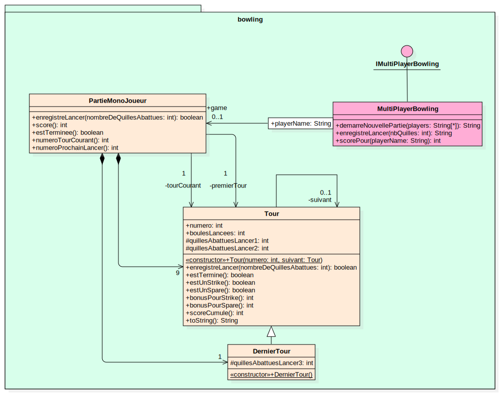

# Solution

## Diagramme de classes

On utilise une [association qualifiée](https://www.pm-consultant.fr/blog_des_ti/uml/faq_ea/ajouter_une_association_qualifiee_entre_2_classes.html) pour indiquer qu'on dispose d'une instance de `MonoPlayerBowling`pour chaque 
nom de joueur. L'implémentation en java utilisera une [Map](https://docs.oracle.com/javase/8/docs/api/java/util/Map.html).

Note : pour compiler ce programme, vous devez d'abord faire `mvn install` sur la [correction de l'exercice "Bowling"](https://github.com/bastide/BowlingMavenCorrection) pour l'installer dans votre repository maven local.
